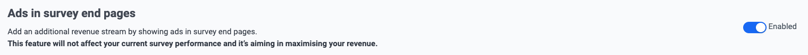
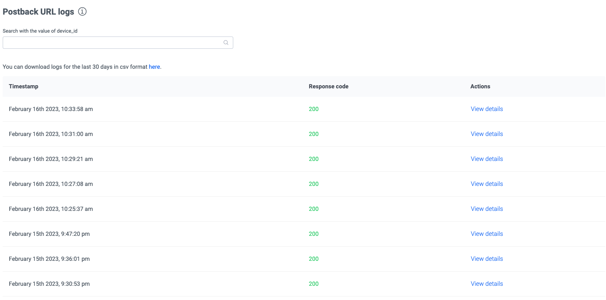

# Magic Receipts Android SDK

# Prerequisites

* Android 21 or higher
* Java 8 or higher

<br/>

# Quick Guide

1. [Create a Pollfish Developer Account](#1-create-a-pollfish-developer-account)
2. [Register a new App on Pollfish Developer Dashboard and copy the given API Key](#2-register-a-new-app-on-pollfish-developer-dashboard-and-copy-the-given-api-key)
3. [Enable Magic Receipts in your account](#3-enable-magic-receipts-in-your-account)
4. [Download and import Magic Receipts library into your project](#4-download-and-import-magic-receipts-library-into-your-project)
5. [Import Magic Receipts classes](#5-import-magic-receipts-classes)
6. [Configure and initialize Magic Receipts SDK](#6-configure-and-initialize-magic-receipts-sdk)

Optional

7. [Listen for Magic Receipts lifecycle events](#7-listen-for-magic-receipts-lifecycle-events)
8. [Control the SDK](#8-control-the-sdk)
9. [Configure proguard](#9-proguard)
10. [Configure postbacks](#postbacks)

<br/>

# Detailed Steps

## 1. Create a Pollfish Developer Account

Register as a Publisher at [pollfish.com](https://pollfish.com/login/publisher)

<br/>

## 2. Register a new App on Pollfish Developer Dashboard and copy the given API Key

Login at [www.pollfish.com](https://pollfish.com/login/publisher) and click "Add a new app" on Pollfish Developer Dashboard. Copy then the given API key for this app in order to use later on, when initializing Pollfish within your code.

<br/>

## 3. Enable Magic Receipts in your account

In your App setting scroll till you find the **Ads in survey end pages** and enable the feature switch.



<br/>

## 4. Download and import Magic Receipts library into your project

You can use one the following methods do download and integrate the Magic Receipts SDK into you project

<br/>

### **Maven** (Coming soon)

Retrieve Magic Receipts through **mavenCentral()** with gradle by adding the following line in your app level **build.gradle** in the dependencies section.

```groovy
dependencies {
    ...
    implementation 'com.prodege:magic-receipts:1.0.0'
}
```

<br/>

### **Manual integration**

Clone the Magic Receipts Android SDK repository and import the `magic-receipts-1.0.0.aar` file into your project libraries. 

If you are using Android Studio, right click on your project and select New Module. Then select Import .JAR or .AAR Package option and from the file browser locate `magic-receipts.aar` file. Right click again on your project and in the Module Dependencies tab choose to add Magic Receipts module that you recently added, as a dependency.

**For Java based projects** you will have to include the Kotlin runtime library in your module dependencies and set the java to version 1.8.

```groovy
android {
    ...
    compileOptions {
        sourceCompatibility JavaVersion.VERSION_1_8
        targetCompatibility JavaVersion.VERSION_1_8
    }
}

dependencies {
    ...
    implemetation "org.jetbrains.kotlin:kotlin-stdlib:1.6.10"
}
```

> **Note:** Skipping this step will result on runtime exception during SDK initialization.

<br/>

## 5. Import Magic Receipts classes

Import Magic Receipts classes with the following lines at the top of your Activity’s class file:

<span style="text-decoration: underline">Kotlin:</span>
```kotlin
import com.prodege.magicreceipts.MagicReceipts
import com.prodege.magicreceipts.builder.*
import com.prodege.magicreceipts.listeners.*
```

<span style="text-decoration: underline">Java:</span>
```java
import com.prodege.magicreceipts.MagicReceipts;
import com.prodege.magicreceipts.builder.*;
import com.prodege.magicreceipts.listeners.*;
```

<br/>

## 6. Configure and initialize Magic Receipts SDK

In order to initialize, you will need to build an instance of `Params` using `Params.Builder`. The `Params.Builder` has only one mandatory parameter which is the API key of your app (step 2 above) and several optional parameters that affect the behaviour of Magic Receipts offer wall.

<br/>

<span style="text-decoration: underline">Kotlin:</span>

```kotlin
val params = Params.Builder("API_KEY")
    .build()
```

<span style="text-decoration: underline">Java:</span>

```java
Params params = Params.Builder("API_KEY")
    .build();
```

Once you have created the `Params` instance, then you can call `MagicReceipts.initialize()` in the `onCreate()` function of your Activity and you are ready to go.

Below you can see an example:

<span style="text-decoration: underline">Kotlin:</span>

```kotlin
override fun onCreate(savedInstanceState: Bundle) {
    ...

    MagicReceipts.initialize(this, params)
}
```

<span style="text-decoration: underline">Java:</span>

```java
@Override
public void onCreate(Bundle savedInstanceState) {
    ...
 
    MagicReceipts.initialize(this, params);
}
```

<br/>

You can set several params to control the behaviour of Magic Receipts survey panel within your app wih the use of `Params.Builder` builder. Below you can see all the available options.

No | Description
--- | -----
6.1 | **`.userId(String)`** <br/> A unique id to identify the user.
6.2 | **`.incentiveMode(Boolean)`** <br/> Control the visibility of the Magic Receipts indicator.
6.3 | **`.clickId(String)`** <br/> A pass throught parameter that will be passed back through server-to-server [postback](#postbacks) to identify the click.

<br/>

### **6.1 `.userId(String)`**

A unique id to identify the user.

<span style="color: red">You can pass the id of a user as identified on your system. Magic Receipts will use this id to identify the user across sessions instead of an ad id/idfa as advised by the stores. You are solely responsible for aligning with store regulations by providing this id and getting relevant consent by the user when necessary. Magic Receipts takes no responsibility for the usage of this id. In any request from your users on resetting/deleting this id and/or profile created, you should be solely liable for those requests.</span>

<br/>

<span style="text-decoration: underline">Kotlin:</span>

```kotlin
val params = Params.Builder("API_KEY")
    .userId("USER_ID")
    .build()
```

<span style="text-decoration: underline">Java:</span>

```java
Params params = new Params.Builder("API_KEY")
    .userId("USER_ID")
    .build();
```

<br/>

By skipping providing a `userId` value, the SDK will try to retrieve the Advertising ID of the device and use that in order to identify the user. In that case you should include the Google Play service into your project in order to access the device's advertising id.

Further details regarding integration with the Google Play services library can be found [here](https://developers.google.com/android/guides/setup).

If you are using gradle you can easily add in your dependencies:

```groovy
dependencies {
    ...
    implementation 'com.google.android.gms:play-services-ads-identifier:20.6.0'
}
```

<br/>

**Android 12**

Apps updating their target API level to 31 (Android 12) or higher will need to declare a Google Play services normal permission in the AndroidManifest.xml file.

```xml
<uses-permission android:name="com.google.android.gms.permission.AD_ID" />
```

You can read more about Google Advertising ID changes [here](https://support.google.com/googleplay/android-developer/answer/6048248).

<br/>

### **6.2. `.incentiveMode(Boolean)`** 

Initializes Magic Receipts SDK in incentivised mode. This means that Magic Receipts Indicator will not be shown and the Magic Receipts offer wall will be automatically hidden until the publisher explicitly calls `.show()` function (The publisher should wait for the `wallLoadedListener` callback). This behaviour enables the option for the publisher, to show a custom prompt to incentivize the user to participate.

<br/>

<span style="text-decoration: underline">Kotlin:</span>

```kotlin
val params = Params.Builder("API_KEY")
    .incentiveMode(true)
    .build()
```

<span style="text-decoration: underline">Java:</span>

```java
Params params = new Params.Builder("API_KEY")
    .incentiveMode(true)
    .build();
```

<br/>

### **6.3. `.clickId(String)`**

A pass through param that will be passed back through server-to-server [postbacks](#postbacks) in order to identify the click.

<br/>

span style="text-decoration: underline">Kotlin:</span>

```kotlin
val params = Params.Builder("API_KEY")
    .clickId("CLICK_ID")
    .build()
```

<span style="text-decoration: underline">Java:</span>

```java
Params params = new Params.Builder("API_KEY")
    .clickId("CLICK_ID")
    .build();
```

<br/>

# Optional section

## 7. Listen for Magic Receipts lifecycle events

In order to get notified for Magic Receipts lifecycle events you will have to register and listen to the appropriate listeners either by passing the interface through the `Params.Builder` (section 5).

<br/>

There are five available interfaces to implement:

No  | Interface | Method
----|-----------|-------------
7.1 | `MagicReceiptsWallLoadedListener` | `onWallDidLoad()` <br/> Get notified when the SDK has loaded
7.2 | `MagicReceiptsWallLoadFailedListener` | `onWallDidFailToLoad(MagicReceiptsLoadError)` <br/> Get notified when the Magic Receipts has failed to load
7.3 | `MagicReceiptsWallShowedListener` | `onWallDidShow()` <br/> Get notified when the Magic Receipts wall has opened
7.4 | `MagicReceiptsWallShowFailedListener` | `onWallDidFailToShow(MagicReceiptsShowError)` <br/> Get notified when the Magic Receipts wall has failed to show
7.5 | `MagicReceiptsWallHiddenListener` | `onWallDidHide()` <br/> Get notified when the Magic Receipts wall has closed

<br/>

### 7.1. Get notified when the SDK has loaded

You can get notified when the SDK has loaded by implementing the `MagicReceiptsWallLoadedListener` interface and override `onWallDidLoad` the function.

Pass an inline object or the interface reference in `Params.Builder`.

<span style="text-decoration: underline">Kotlin:</span>

```kotlin
// Inline
Params.Builder("API_KEY")
    .wallLoadedListener(object : MagicReceiptsWallLoadedListener {
        override fun onWallDidLoad() {
            ...
        }
    })

// Implementation
class MainActivity : AppCompatActivity(), MagicReceiptsWallLoadedListener {
    
    override fun onWallDidLoad() {
        ...
    }

    ...

    Params.Builder("API_KEY")
        .wallLoadedListener(this)

}
```

<span style="text-decoration: underline">Java:</span>

```java
// Inline
new Params.Builder("API_KEY")
    .wallLoadedListener( () -> { 
        ...
    })

// Implementation
public class MainActivity extends AppCompatActivity implements MagicReceiptsWallLoadedListener {

    @Override
    public void onWallDidLoad() {
        ...
    }

    ...

    new Params.Builder("API_KEY")
        .wallLoadedListener(this)

}
```

<br/>

### 7.2. Get notified when the Magic Receipts has failed to load

You can get notified when the Magic Receipts has failed to load by implementing the `MagicReceiptsWallFailedToLoadListener` interface and override the `onWallDidFailToLoad` function.

Pass an inline object or the interface reference in `Params.Builder`.

<span style="text-decoration: underline">Kotlin:</span>

```kotlin
// Inline
Params.Builder("API_KEY")
    .wallLoadFailedListener(object : MagicReceiptsWallLoadFailedListener {
        override fun onWallDidFailToLoad(error: MagicReceiptsLoadError) {
            ...
        }
    })

// Implementation
class MainActivity : AppCompatActivity(), MagicReceiptsWallLoadFailedListener {
    
    override fun onWallDidFailToLoad(error: MagicReceiptsLoadError) {
        ...
    }

    ...
    Params.Builder("API_KEY")
        .wallLoadFailedListener(this)

}
```

<span style="text-decoration: underline">Java:</span>

```java
// Inline
new Params.Builder("API_KEY")
    .wallLoadFailedListener(error -> { 
        ...
    })

// Implementation
public class MainActivity extends AppCompatActivity implements MagicReceiptsWallLoadFailedListener {

    @Override
    public void wallLoadFailedListener(MagicReceiptsLoadError error) {
        ...
    }

    ...

    new Params.Builder("API_KEY")
        .wallLoadFailedListener(this)

}
```

<br/>

### 7.3. Get notified when the Magic Receipts wall has opened

You can get notified when the Magic Receipts wall has opened by implementing the `MagicReceiptsWallShowedListener` interface and override the `onWallDidShow` function.

Pass an inline object or the interface reference in `Params.Builder`.

<span style="text-decoration: underline">Kotlin:</span>

```kotlin
// Inline
Params.Builder("API_KEY")
    .wallShowedListener(object : MagicReceiptsWallShowedListener {
        override fun onWallDidShow() {
            ...
        }
    })

// Implementation
class MainActivity : AppCompatActivity(), MagicReceiptsWallShowedListener {
    
    override fun onWallDidShow() {
        ...
    }

    ...

    Params.Builder("API_KEY")
        .wallShowedListener(this)

}
```

<span style="text-decoration: underline">Java:</span>

```java
// Inline
new Params.Builder("API_KEY")
    .wallShowedListener(error -> { 
        ...
    })

// Implementation
public class MainActivity extends AppCompatActivity implements MagicReceiptsWallShowedListener {

    @Override
    public void onWallDidShow() {
        ...
    }

    ...

    new Params.Builder("API_KEY")
        .wallShowedListener(this)

}
```

<br/>

### 7.4. Get notified when the Magic Receipts wall has failed to show

You can get notified when the Magic Receipts wall has failed to show by implementing the `MagicReceiptsWallShowFailedListener` interface and override the `onWallDidFailToShow` function.

Pass an inline object or the interface reference in `Params.Builder`.

<span style="text-decoration: underline">Kotlin:</span>

```kotlin
// Inline
Params.Builder("API_KEY")
    .wallShowFailedListener(object : MagicReceiptsWallShowFailedListener {
        override fun onWallDidFailToShow(error: MagicReceiptsShowError) {
            ...
        }
    })

// Implementation
class MainActivity : AppCompatActivity(), MagicReceiptsWallShowFailedListener {
    
    override fun onWallDidFailToShow(error: MagicReceiptsShowError) {
        ...
    }

    ...

    Params.Builder("API_KEY")
        .wallShowFailedListener(this)

}
```

<span style="text-decoration: underline">Java:</span>

```java
// Inline
new Params.Builder("API_KEY")
    .wallShowFailedListener(error -> { 
        ...
    })

// Implementation
public class MainActivity extends AppCompatActivity implements MagicReceiptsWallShowFailedListener {

    @Override
    public void onWallDidFailToShow(MagicReceiptsShowError error) {
        ...
    }

    ...

    new Params.Builder("API_KEY")
        .wallShowFailedListener(this)

}
```

<br/>

### 7.5. Get notified when the Magic Receipts wall has closed

You can get notified when the Magic Receipts wall has closed by implementing the `MagicReceiptsWallHiddenListener` interface and override the `onWallDidHide` function.

Pass an inline object or the interface reference in `Params.Builder`.

<span style="text-decoration: underline">Kotlin:</span>

```kotlin
// Inline
Params.Builder("API_KEY")
    .wallHiddenListener(object : MagicReceiptsWallHiddenListener {
        override fun onWallDidHide() {
            ...
        }
    })

// Implementation
class MainActivity : AppCompatActivity(), MagicReceiptsWallHiddenListener {
    
    override fun onWallDidHide() {
        ...
    }

    Params.Builder("API_KEY")
        .wallHiddenListener(this)

}
```

<span style="text-decoration: underline">Java:</span>

```java
// Inline
new Params.Builder("API_KEY")
    .wallHiddenListener(error -> { 
        ...
    })

// Implementation
public class MainActivity extends AppCompatActivity implements MagicReceiptsWallHiddenListener {

    @Override
    public void onWallDidHide() {
        ...
    }

    ...

    new Params.Builder("API_KEY")
        .wallHiddenListener(this)

}
```

<br/>

## 8. Control the SDK 

### 8.1. Manually show/hide Magic Receipts views

You can manually hide or show Magic Receipts offer wall or indicator by calling the following methods after initialization:

#### 8.1.1. Show

<span style="text-decoration: underline">Kotlin:</span>

```kotlin
MagicReceipts.show()
```

<span style="text-decoration: underline">Java:</span>

```java
MagicReceipts.show();
```

#### 8.1.2. Hide

<span style="text-decoration: underline">Kotlin:</span>

```kotlin
MagicReceipts.hide()
```

<span style="text-decoration: underline">Java:</span>

```java
MagicReceipts.hide();
```

<br/>

### 8.2. Check if Magic Receipts SDK is ready

At anytime you can check whether the Magic Receipts SDK is ready to show the wall or not.

<span style="text-decoration: underline">Kotlin:</span>

```kotlin
MagicReceipts.isReady()
```

<span style="text-decoration: underline">Java:</span>

```java
MagicReceipts.isReady();
```

## 9. Proguard

If you use proguard with your app, please insert the following lines in your proguard configuration file:  

```java
-dontwarn com.prodege.magicreceipts.**
-keep class com.prodege.magicreceipts.** { *; }
```

# Postbacks

You can easily setup postbacks in order to receive a notifications when a conversion has happened.

## 9.1. Configure your Postback URL

You can set a Server-to-Server webhook URL through Pollfish developer dashboard, in your app's page. On every conversion we will perform a HTTP GET request to this URL.


<br/>

> **Note:** You should use this call to verify a conversion if you reward your users for their action. This is the only 100% accurate and secure way to monitor conversions through your app.

<br/>

Server-to-server callbacks can be used to retrieve several information regarding a conversion. Below there is a list of all the available tempate params you can use to configure your Postback URL.

Parameter name | Type | Description
---------------|------|------------
click_id       |String| The pass-through parameter used to identify the click
cpa            |Int   | Money earned from conversion in USD
device_id      |String| User/Device identifier
timestamp      |Long  | Transaction timestamp
tx_id          |String| Unique transaction identifier
signature      |String| A Base64 Url encoded string securing the above parameters

<br/>

## 9.2. Uniquely identify a conversion and avoiding duplicates

Mistakes may happen, and you may receive multiple callbacks for the same conversion. You can avoid those duplicates by checking the tx_id param. This identifier is unique per conversion transaction.

<br/>

## 9.3. Secure your postbacks

You can secure your callback by adding the signature template parameter in your callback URL. In addition you will have to include at least one of the rest supported template parameters because signing is happening on the parameters and not on the url.

```
http://www.example.com/callback?tx_id=[[tx_id]]&time=[[timestamp]]&cpa=[[cpa]]&device=[[device_id]]&click_id=[[click_id]]&sig=[[signature]]
```

<br/>

### 9.3.1 How signatures are produced

The signature of the callback URLs is the result of appling the HMAC-SHA1 hash function to the [[parameters]] that are included in the URL using your account's secret_key.

We only sign the values that are substituted using the parameters placeholders `[[click_id]]`, `[[cpa]]`, `[[device_id]]`, `[[timestamp]]` and `[[tx_id]]`. We do not sign any other part of the URL including any other URL parameters that the publisher might specify.

Your secret_key is an auto-generated key by Pollfish that serves as a shared secret between the publisher and Pollfish. You can find out more about your secret_key at the Account Information page.

To sign the parameters they are assembled in alphabetical order using the parameter placeholder names in a string by concatenating them using the colon `:` character. For example if you have the follwing URL template:

```
https://www.example.com?device_id=[[device_id]]&cpa=[[cpa]]&timestamp=[[timespamp]]&tx_id=[[tx_id]]&click_id=[[click_id]]&signature=[[signature]]
```

with this as a secret key 

```
4dd95289-3961-4a1f-a216-26fa0f99ca87
```

Then the produced string, that will be the input to HMAC-SHA1, will have the pattern: 

```
click_id:cpa:device_id:timestamp:tx_id
```

Furthermore if we have the following values: `device_id=my-device-id`, `cpa=30`, `timestamp=1463152452308`, `click_id=a-unique-click-id` and `tx_id=123456789` the string that will be the input to HMAC-SHA1 will be:

```
a-unique-click-id:30:my-device-id:1463152452308:123456789
```

and the produced callback URL will be:

```
https://www.example.com?device_id=my-device-id&cpa=30&timestamp=1463152452308&tx_id=123456789&click_id=a-unique-click-id&signature=h4utQ%2Fi9u7VGTyf9BGi37A08cIE%3D
```

Please note that the string is created using the parameter values before they are URL encoded.

Additionally since `click_id` is an optional parameter that might be skipped during the SDK initialization and you have defined the corresponding template parameter in your callback URL, then it should be included in the signature calculation with an empty value, So your signing payload should match the following 

```
:30:my-device-id:1463152452308:123456789
```

<br/>

### 9.3.2 How to verify signatures

To verify the signature in server-to-server postback calls follow the below proceedure:

1. Extract the value of the signature parameter from the URL.
2. URL decode the value you extracted in (1) using Percent encoding
3. Extract the values of the rest of the parameters URL.
4. URL decode the values you extracted in (3) using Percent encoding.
5. Sort the values from (4) alphabeticaly using the names of the template parameters. The names of the template parameters in sorted order are: click_id, cpa, device_id, timestamp, tx_id and not the names of any URL parameters your URL may contain.
6. Produce a string by concatenating all non-empty parameter values as sorted in the previous step using the `:` character. The only parameter that when specified in the URL template can be empty is `click_id`. There is a special handling for term_reason: If the user is non-eligible then it has one of the values described in section 6 and with that value is included in the callback url and the signature calculation. If however the user is eligible the term is included but with an empty value and must participate in the signature calculation. An example of a callback url for an eligible user is https://mybaseurl.com?device_id=my-device-id&term_reason=&cpa=30 which gives the string 30:my-device-id: for signature calculation. The trailing : is because of the empty term_reason
7. Sign the string produced in (6) using the HMAC-SHA1 algorithm and your account's secret_key that can be retrieved from the Account Information page.
8. Encode the value produced in (7) using Base64. Please note that the input to the Base64 function must be the raw byte array output of HMAC-SHA1 and not a string representation of it.
9. Compare the values produced in (2) and (8). If they are equal then the signature is valid.

<br/>

## 9.4. Check postback logs

You can check logs from your s2s callbacks history simply by navigating to End Page Ads -> Monitoring page on your Dashboard.



In this page you will find all callbacks generated from Pollfish servers for your app, sorted by date. You can easily track the status of each call and response from you server side. Each call in the logs is clickable and you can also search for a specific callback based on specific params of your url structure.
